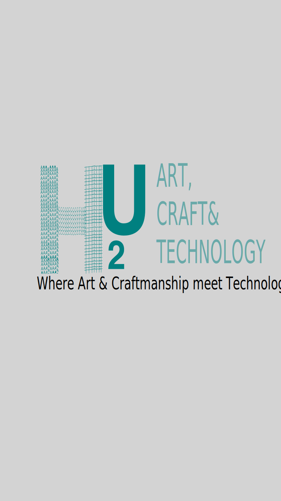

# HUTU - Where Art & Craftsmanship Meet Technology



A modern, responsive website for HUTU, showcasing our blend of creative and technical services. Built with React, TypeScript, and Tailwind CSS.

## Features

- 🎨 **Graphics Arts Services**
  - Brand Identity Design
  - Marketing Materials
  - Custom T-Shirt Design
  - Digital Illustrations
  - Packaging Design

- 🏠 **Interior Crafts**
  - Custom Wall Finishes
  - Modern Living Spaces
  - Kitchen Renovations
  - Office Spaces
  - Decorative Elements

- 💻 **Technology Solutions**
  - CCTV Installation
  - Network Infrastructure
  - Software Solutions
  - Access Control
  - System Integration

## Tech Stack

- React 18
- TypeScript
- Tailwind CSS
- Framer Motion
- React Router
- Lucide React Icons

## Getting Started

1. Clone the repository
```bash
git clone <repository-url>
```

2. Install dependencies
```bash
npm install
```

3. Start the development server
```bash
npm run dev
```

4. Build for production
```bash
npm run build
```

## Project Structure

```
src/
├── components/         # Reusable UI components
├── pages/             # Page components
├── assets/            # Static assets
├── App.tsx           # Main application component
└── main.tsx          # Application entry point
```

## Key Components

- **Header**: Responsive navigation with mobile menu
- **Hero**: Dynamic landing section with animations
- **ServiceSection**: Reusable service showcase component
- **ProductGallery**: Grid layout for displaying work samples
- **ContactForm**: Interactive contact form
- **Footer**: Site navigation and social links

## Responsive Design

- Mobile-first approach
- Breakpoint-specific layouts
- Touch-friendly navigation
- Optimized images and animations

## Contact

For inquiries, reach out through:
- WhatsApp Button in the header
- Contact form
- Social media links in the footer

## License

All rights reserved © HUTU
